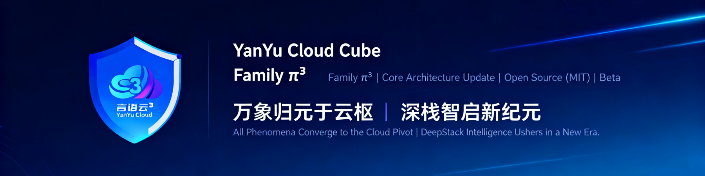

<div align="center">



# YYC³ AI Intelligent Calling

**YanYuCloudCube™** · 言启象限 · 语枢未来

*Words Initiate Quadrants, Language Serves as Core for Future*

万象归元于云枢 | 深栈智启新纪元

*All things converge in cloud pivot; Deep stacks ignite a new era of intelligence*

---

[](https://ai-call.yyc3.vip)
[](https://github.com/YYC-Cube/yyc3-ai-call/actions)
[](LICENSE)
[](CONTRIBUTING.md)

[](https://nextjs.org/)
[](https://www.typescriptlang.org/)
[](https://reactjs.org/)
[](https://www.prisma.io/)
[](https://www.postgresql.org/)
[](https://redis.io/)
[](https://www.docker.com/)
[](https://tailwindcss.com/)
[](https://ui.shadcn.com/)
[](https://pnpm.io/)

**AI 驱动的企业级智能外呼系统 | Enterprise-Grade AI-Powered Intelligent Calling Platform**

[🌐 Live Demo](https://ai-call.yyc3.vip) · [📖 Documentation](./docs/START_HERE.md) · [🤝 Contributing](./CONTRIBUTING.md) · [🔒 Security](./SECURITY.md)

</div>

---

## Overview

YYC³ AI Intelligent Calling 是由 **YanYuCloudCube™** 团队构建的企业级智能外呼平台。系统深度融合大语言模型（ChatGLM3-6B / 智谱 AI）、多模态处理引擎与 8 智能体协同矩阵，为教育、医疗、金融、客服等行业提供全链路智能化呼叫解决方案。

### Core Architecture Principles

| Dimension | Standard |
|-----------|----------|
| **Five-High** | High Availability · High Performance · High Security · High Scalability · High Intelligence |
| **Five-Standard** | Standardization · Normalization · Automation · Visualization · Intelligence |
| **Five-Transformation** | Process-Oriented · Digitalization · Ecologicalization · Tool-Oriented · Service-Oriented |

### Key Capabilities

| Module | Description | Status |
|--------|-------------|--------|
| 🧠 AI Family 8-Agent Matrix | 元启·天枢、智云·守护等 8 智能体协同调度 | ✅ |
| 📞 Smart Call System | AI 驱动的智能外呼与任务调度 | ✅ |
| 🎯 Intent & Sentiment | NLP 意图识别 + 情感分析双引擎 | ✅ |
| 📊 Data Analytics | 实时数据监控与可视化分析 | ✅ |
| 👥 Customer 360° | 全维度客户画像与 CRM 管理 | ✅ |
| 🤖 MCP Protocol | Model Context Protocol 标准化工具集成 | ✅ |
| 🔄 Multimodal | 文本/语音/图像多模态处理 | ✅ |
| 📱 PWA Support | Service Worker + 离线访问 | ✅ |

---

## Tech Stack

```
┌─────────────────────────────────────────────────────────────────┐
│  Presentation Layer                                              │
│  Next.js 14.2 · React 18.3 · TypeScript · Tailwind CSS 3.4     │
│  shadcn/ui · Radix UI · Recharts · Lucide Icons                 │
├─────────────────────────────────────────────────────────────────┤
│  API & Service Layer                                             │
│  Next.js API Routes · Zod Validation · JWT Auth · RBAC          │
│  AI Family Manager · MCP Client · WebSocket Server              │
├─────────────────────────────────────────────────────────────────┤
│  AI & Intelligence Layer                                         │
│  ChatGLM3-6B · vLLM · Whisper ASR · VITS TTS                   │
│  Zhipu AI · Intent Recognition · Sentiment Analysis             │
│  8-Agent Collaboration · Multimodal Processing                  │
├─────────────────────────────────────────────────────────────────┤
│  Data & Infrastructure Layer                                     │
│  PostgreSQL 16 · Prisma ORM 5.22 · Redis 7 (ioredis)           │
│  Docker · Docker Compose · Nginx · K8s Ready                    │
├─────────────────────────────────────────────────────────────────┤
│  DevOps & Quality                                                │
│  GitHub Actions CI/CD · Jest · Playwright · ESLint · Prettier   │
│  Husky · pnpm Monorepo · PWA · Service Worker                   │
└─────────────────────────────────────────────────────────────────┘
```

### 9-Package Ecosystem

| Package | Purpose |
|---------|---------|
| `@yyc3/core` | Core library — auth, MCP client, skills |
| `@yyc3/ui` | Shared UI component registry |
| `@yyc3/ai-hub` | AI agent hub — routing, family, skills |
| `@yyc3/emotion` | Emotion analysis engine |
| `@yyc3/i18n-core` | Internationalization — zh/en/ar/de |
| `@yyc3/cli` | CLI tool — scaffolding, registry, templates |
| `@yyc3/ide` | IDE integration — Monaco, Sandpack, Git |
| `@yyc3/ide-utils` | IDE utility functions |
| Main App | `yyc3-ai-intelligent-calling` |

---

## AI Family — 8-Agent Matrix

| Agent | Role | Specialty |
|-------|------|-----------|
| 🌟 元启·天枢 (Meta-Oracle) | MASTER | 全局编排、任务分发、协同决策 |
| 🛡️ 智云·守护 (Cloud-Guardian) | GUARDIAN | 安全审计、合规检查、风险预警 |
| 🔮 洞察·先知 (Insight-Prophet) | PROPHET | 数据分析、趋势预测、智能推荐 |
| 🧠 思辨·哲者 (Thinker) | THINKER | 推理分析、知识图谱、逻辑验证 |
| 🎯 精准·择优 (Recommender) | RECOMMENDER | 意图识别、最优路径、资源匹配 |
| 🔗 融通·协作者 (Collaborator) | COLLABORATOR | 跨域协同、流程编排、生态对接 |
| 📚 博学·知识库 (Scholar) | SCHOLAR | 知识检索、RAG 增强、文档解析 |
| ⚡ 执行·实干家 (Executor) | EXECUTOR | 任务执行、工具调用、结果交付 |

---

## Quick Start

### Prerequisites

```bash
Node.js >= 20.0.0    # Required for GitHub Actions CI
pnpm >= 8.0.0
Docker >= 20.10.0    # Optional, for containerized deployment
```

### Installation

```bash
git clone https://github.com/YYC-Cube/yyc3-ai-call.git
cd yyc3-ai-call

pnpm install
cp .env.example .env
npx prisma generate
pnpm dev
```

Access at [http://localhost:3000](http://localhost:3000)

### Docker Compose

```bash
docker-compose up -d
docker-compose logs -f app
```

### Static Export (GitHub Pages)

```bash
NEXT_STATIC_EXPORT=1 pnpm build
# Output in ./out/ — deploy to any static host
```

---

## Project Structure

```
yyc3-ai-call/
├── app/                          # Next.js App Router
│   ├── api/                      # API Routes (Auth, AI, Customers, MCP...)
│   ├── layout.tsx                # Root layout (PWA metadata, theme)
│   ├── page.tsx                  # Dashboard home
│   └── globals.css               # Global styles + Tailwind
├── components/
│   ├── ui/                       # 50+ shadcn/ui components
│   ├── smart-call-system.tsx     # Smart call dashboard
│   ├── customer-management.tsx   # CRM module
│   ├── data-analytics.tsx        # Analytics module
│   └── ...                       # Business modules
├── lib/
│   ├── ai-family/                # 8-Agent system (manager, definitions, types)
│   ├── auth/                     # JWT auth + RBAC (USER/AGENT/MANAGER/ADMIN)
│   ├── mcp/                      # Model Context Protocol client/server
│   ├── multimodal/               # Text/Audio/Image/Document processing
│   ├── security/                 # Middleware, validation, rate limiting
│   ├── tenant/                   # Multi-tenant management
│   ├── db.ts                     # Prisma client singleton
│   └── validations.ts            # Zod schemas for all API inputs
├── ai-services/                  # AI service layer
│   ├── llm/                      # Qwen LLM service
│   ├── asr/                      # Whisper ASR service
│   ├── tts/                      # VITS TTS service
│   └── nlp/                      # Intent + Sentiment services
├── docs/                         # Documentation (see docs/START_HERE.md)
├── public/
│   ├── CNAME                     # GitHub Pages custom domain
│   ├── manifest.webmanifest      # PWA manifest
│   ├── sw.js                     # Service Worker
│   └── yyc3-icons/               # PWA icons (all platforms)
├── tests/
│   ├── unit/                     # 166 unit tests (Jest)
│   ├── integration/              # Integration tests
│   └── e2e/                      # E2E tests (Playwright)
├── .github/workflows/
│   ├── ci.yml                    # PR/push quality gate
│   ├── deploy-pages.yml          # GitHub Pages → ai-call.yyc3.vip
│   └── ci-cd.yml                 # Full pipeline (7 stages)
├── prisma/schema.prisma          # Database models
├── docker-compose.yml            # 5 services (app, postgres, redis, ollama, nginx)
├── Dockerfile                    # Multi-stage build (tini, non-root)
└── next.config.mjs               # Conditional static export
```

---

## Available Scripts

| Command | Description |
|---------|-------------|
| `pnpm dev` | Start development server |
| `pnpm build` | Build for production |
| `pnpm start` | Start production server |
| `pnpm lint` | ESLint code check |
| `pnpm type-check` | TypeScript strict check (`tsc --noEmit`) |
| `pnpm test` | Run Jest tests |
| `pnpm test:coverage` | Test coverage report |
| `pnpm test:e2e` | Playwright E2E tests |
| `pnpm db:migrate` | Prisma database migration |
| `pnpm db:studio` | Prisma Studio GUI |
| `pnpm docker:build` | Build Docker image |
| `pnpm docker:run` | Start Docker containers |

---

## CI/CD Pipeline

```
Push to main ──► CI Workflow ──► Deploy Pages
                    │                  │
                    ├─ Lint            ├─ Build Static Site
                    ├─ Type Check      ├─ Verify CNAME
                    ├─ Unit Tests      ├─ Upload Artifact
                    └─ Build           └─ Deploy to ai-call.yyc3.vip
```

| Workflow | Trigger | Purpose |
|----------|---------|---------|
| `ci.yml` | PR / Push to main | Quality gate: lint + type-check + test + build |
| `deploy-pages.yml` | Push to main | Build & deploy to GitHub Pages |
| `ci-cd.yml` | Push / Manual | Full 7-stage pipeline with Docker & K8s |

---

## Deployment

### GitHub Pages (Current)

Static site deployed to **[ai-call.yyc3.vip](https://ai-call.yyc3.vip)** via GitHub Pages with custom domain.

### Docker Compose

```bash
docker-compose up -d                    # Start all 5 services
docker-compose logs -f app              # Follow app logs
```

Services: `app` (Next.js) · `postgres` (PostgreSQL 16) · `redis` (Redis 7) · `ollama` (LLM) · `nginx` (Reverse proxy)

### Environment Variables

| Variable | Required | Description |
|----------|----------|-------------|
| `DATABASE_URL` | ✅ | PostgreSQL connection string |
| `REDIS_URL` | ✅ | Redis connection URL |
| `JWT_SECRET` | ✅ | JWT signing secret |
| `NEXT_PUBLIC_APP_URL` | ❌ | Public app URL |
| `QWEN_LLM_BASE_URL` | ❌ | LLM API endpoint |
| `OPENAI_API_KEY` | ❌ | OpenAI API key |

Full configuration: [`.env.example`](./.env.example)

---

## Testing

| Type | Framework | Scope |
|------|-----------|-------|
| Unit | Jest | 166 tests across 18 suites |
| Integration | Jest | API + service layer |
| E2E | Playwright | User workflows |
| Performance | k6 | Load / Stress / Soak |

---

## Documentation

All documentation lives in [`docs/`](./docs/START_HERE.md):

| Directory | Content |
|-----------|---------|
| `YYC3-AI-Call-架构设计/` | Architecture design documents |
| `YYC3-AI-Call-API文档/` | API specifications |
| `YYC3-AI-Call-产品文档/` | Product documentation |
| `YYC3-AI-Call-测试验证/` | Testing & QA |
| `YYC3-AI-Call-部署发布/` | Deployment guides |
| `YYC3-团队通用-标准规范/` | Team standards & conventions |
| `YYC3-技能知识库-全景可视化架构文档.md` | Knowledge base visualization |

---

## Contributing

We welcome contributions! Please see [CONTRIBUTING.md](./CONTRIBUTING.md) for guidelines.

1. Fork the repository
2. Create your feature branch (`git checkout -b feature/amazing-feature`)
3. Commit your changes (`git commit -m 'feat: add amazing feature'`)
4. Push to the branch (`git push origin feature/amazing-feature`)
5. Open a Pull Request

---

## License

This project is licensed under the **MIT License** — see the [LICENSE](LICENSE) file for details.

---

<div align="center">

**YanYuCloudCube™** · 言启象限 · 语枢未来

*Words Initiate Quadrants, Language Serves as Core for Future*

Copyright © 2026 YanYuCloudCube Team. All rights reserved.

</div>
