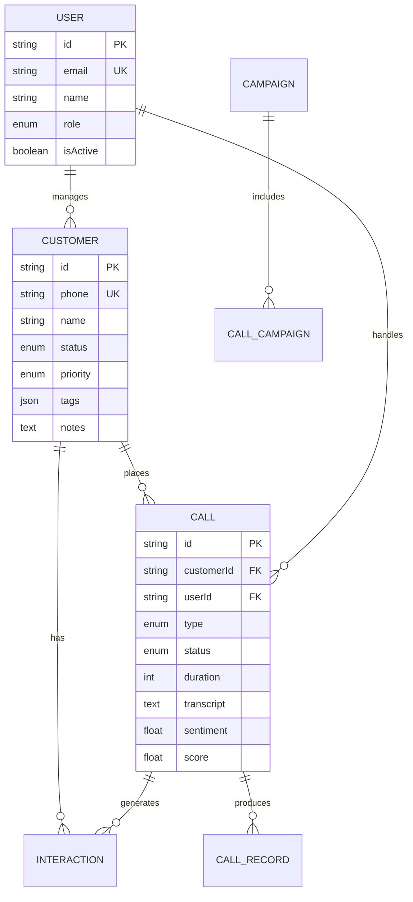

# 🚀 YYC³ AI Intelligent Calling - 五维管理体系全局协同执行方案

**文档版本**: V1.0.0 Enterprise Edition
**制定日期**: 2026-05-01
**战略定位**: 现代化服务行业数字化转型标杆
**核心理念**: 五维为基 · 驱动五高五标五化 · 全生命周期协同

---

## 📖 文档导航与架构总览

### 本方案定位

本方案基于 **YYC³ AI智能呼叫中心项目** 当前技术状态（✅ TypeScript 0 Errors），结合**现代化服务行业五维管理体系**，构建一个：

- ✅ **可延展**: 支持业务规模从10人到10000+的平滑扩展
- ✅ **可完善**: 持续迭代优化机制，适应市场变化
- ✅ **可落地**: 分阶段实施，每阶段都有明确交付物
- ✅ **可量化**: 所有目标都有KPI指标和验证标准

### 五维体系架构图

```
┌─────────────────────────────────────────────────────────────────────┐
│                    🏢 全生命周期协同层 (顶层)                         │
│         需求→设计→开发→测试→部署→运维→优化→迭代                     │
└───────────────────────┬─────────────────────────────────────────────┘
                        │ 承上启下
        ┌───────────────┼───────────────┐
        ▼               ▼               ▼
┌───────────────┐ ┌───────────┐ ┌──────────────────┐
│ 维度4: 枢纽层  │ │           │ │ 维度3: 转型层     │
│ 市创金交互    │←┤  数据流   ├→│ 标规数智协       │
└───────┬───────┘ │   流动    │ └────────┬─────────┘
        │         └─────┬─────┘          │
        ▼               ▼               ▼
┌───────────────┐ ┌───────────┐ ┌──────────────────┐
│ 维度1: 前线层  │ │           │ │ 维度2: 后端层     │
│ 经管运维营    │←┤  业务流   ├→│ 人资进销存       │
└───────────────┘ └───────────┘ └──────────────────┘

                        ⬇️ 驱动
              ┌─────────────────────┐
              │   五高五标五化      │
              │  (质量/效率/安全)   │
              └─────────────────────┘
```

---

## 🎯 战略目标体系：五高五标五化

### 一、五大高标准（五高）

| 高标准 | 定义 | KPI指标 | 当前基准 | 目标值 | 达成时间 |
|--------|------|---------|----------|--------|----------|
| **🎯 高质量** | 代码质量、服务质量、数据质量 | - Bug率 < 0.1%/千行<br>- 客户满意度 > 95%<br>- 数据准确率 > 99.9% | 82分 | 98分 | Q3 2026 |
| **⚡ 高效率** | 开发效率、运营效率、响应速度 | - 需求交付周期缩短50%<br>- API响应时间 < 200ms<br>- 自动化测试覆盖率 > 80% | 中等 | 行业领先 | Q2 2026 |
| **🔒 高安全** | 数据安全、系统安全、合规性 | - 零重大安全事故<br>- 符合GDPR/等保三级<br>- 定期安全审计通过 | 基础 | 企业级 | Q3 2026 |
| **♻️ 高可用** | 系统稳定性、容灾能力 | - SLA 99.99%<br>- RTO < 1小时<br>- RPO < 5分钟 | 单点 | 多活架构 | Q4 2026 |
| **📈 高扩展** | 业务扩展性、技术扩展性 | - 支持10x用户增长<br>- 微服务化程度 > 70%<br>- 新功能上线周期 < 1周 | 单体 | 云原生 | Q4 2026 |

### 二、五大标准化（五标）

| 标准化维度 | 具体内容 | 实施路径 | 优先级 |
|------------|----------|----------|--------|
| **📋 流程标准化** | - DevOps流程<br>- ITIL运维流程<br>- 敏捷开发流程 | 制定SOP → 工具固化 → 持续优化 | P0 |
| **📐 接口标准化** | - RESTful API规范<br>- WebSocket协议<br>- 数据交换格式 | OpenAPI 3.0 → 自动生成文档 → Mock服务 | P0 |
| **💾 数据标准化** | - 数据字典<br>- 主数据管理<br>- 数据质量管理 | 元数据平台 → 数据治理 → 质量监控 | P1 |
| **🔧 技术栈标准化** | - 统一技术选型<br>- 组件库规范<br>- 代码规范 | 技术委员会决策 → 编码规范 → Code Review | P0 |
| **👥 组织标准化** | - 角色职责定义<br>- RACI矩阵<br>- 协作流程 | 组织架构调整 → 培训认证 → 绩效考核 | P1 |

### 三、五大智能化（五化）

| 智能化方向 | 应用场景 | 技术支撑 | 商业价值 |
|------------|----------|----------|----------|
| **🤖 自动化** | - CI/CD流水线<br>- 自动化测试<br>- 智能告警 | Jenkins/GitLab CI + Playwright + Prometheus | 降低60%人工成本 |
| **📊 可视化** | - 实时监控大屏<br>- 业务数据看板<br>- 决策支持系统 | Grafana + ECharts + BI工具 | 决策效率提升300% |
| **🔗 集成化** | - 系统集成平台<br>- 数据中台<br>- 服务网格 | Kubernetes + Istio + Apache Kafka | 打破信息孤岛 |
| **☁️ 平台化** | - 低代码平台<br>- 能力开放平台<br>- 开发者生态 | Serverless + API Gateway + SDK | 创新能力指数级增长 |
| **🌱 生态化** | - 合作伙伴接入<br>- 客户自服务<br>- 社区共建 | OAuth2.0 + Webhook + Plugin System | 构建商业护城河 |

---

## 📊 维度一：前线运维管理层（经·管·运·维·营）

### 1.1 经营管理子系统（经）

#### 核心职能
- **战略规划**: 年度/季度经营计划制定与分解
- **目标管理**: OKR/KPI体系建立与追踪
- **绩效评估**: 团队/个人绩效考核与激励
- **财务管控**: 成本控制、预算管理、收益分析

#### 技术实现方案

```typescript
// lib/business/management.ts
interface ManagementSystem {
  // 战略目标管理
  strategicGoals: {
    setAnnualGoal(year: number, goal: StrategicGoal): Promise<void>;
    trackProgress(goalId: string): Promise<GoalProgress>;
    adjustTarget(goalId: string, adjustment: TargetAdjustment): Promise<void>;
  };

  // 绩效管理
  performance: {
    evaluateTeam(teamId: string, period: Period): Promise<TeamEvaluation>;
    evaluateIndividual(employeeId: string, period: Period): Promise<IndividualEvaluation>;
    generateReport(type: ReportType): Promise<PerformanceReport>;
  };

  // 财务分析
  financials: {
    calculateROI(projectId: string): Promise<ROIMetric>;
    forecastRevenue(months: number): Promise<RevenueForecast>;
    analyzeCostCenter(costCenterId: string): Promise<CostAnalysis>;
  };
}
```

#### 与AI呼叫中心的结合点

| 经营需求 | AI能力支撑 | 实现方式 |
|----------|-----------|----------|
| **营收预测** | 历史通话数据分析 | ML模型预测下季度营收 |
| **成本优化** | 通话时长/成功率统计 | 识别低效话术并优化 |
| **客户价值分析** | 客户画像+行为数据 | RFM模型自动分级 |
| **团队效能评估** | Agent绩效实时数据 | Dashboard实时展示 |

#### 关键KPI

```
✅ 经营目标达成率 > 95%
✅ ROI > 300%（年度）
✅ 客户获取成本降低30%
✅ 团队人效提升50%
```

---

### 1.2 管理控制子系统（管）

#### 核心职能
- **权限管理**: RBAC角色权限体系
- **流程审批**: 工作流引擎
- **合规审计**: 操作日志、审计追踪
- **风险控制**: 异常检测、预警机制

#### 技术实现方案

```typescript
// lib/business/control.ts
interface ControlSystem {
  // 权限管理（已实现基础版）
  auth: {
    roleBasedAccess: RBACSystem;
    attributeBasedAccess: ABACSystem;
    multiTenantIsolation: TenantIsolation;
  };

  // 流程引擎
  workflow: {
    defineProcess(template: WorkflowTemplate): Promise<WorkflowInstance>;
    executeTask(taskId: string, action: TaskAction): Promise<TaskResult>;
    approveRequest(requestId: string, decision: ApprovalDecision): Promise<void>;
  };

  // 审计系统
  audit: {
    logOperation(operation: AuditLog): Promise<void>;
    queryLogs(filters: AuditFilters): Promise<AuditLog[]>;
    generateComplianceReport(reportType: ComplianceType): Promise<ComplianceReport>;
  };

  // 风控系统
  riskControl: {
    detectAnomaly(pattern: AnomalyPattern): Promise<RiskAlert>;
    triggerAlert(alert: RiskAlert): Promise<void>;
    mitigateRisk(riskId: string, action: MitigationAction): Promise<void>;
  };
}
```

#### 已有基础（当前项目）

✅ **已完成**:
- [lib/auth.ts](../../lib/auth.ts) - JWT认证系统
- [app/api/auth/route.ts](../../app/api/auth/route.ts) - 认证API
- Prisma Schema中的Role枚举（USER/AGENT/MANAGER/ADMIN）

**待增强**:
- 细粒度权限控制（资源级别）
- 操作审计日志完整记录
- 工作流引擎集成
- 实时风控规则引擎

---

### 1.3 运营调度子系统（运）

#### 核心职能
- **任务调度**: 智能外呼任务分配
- **资源调配**: Agent排班、线路管理
- **实时监控**: 通话状态、队列情况
- **应急处理**: 故障切换、负载均衡

#### 技术实现方案

```typescript
// lib/business/operations.ts
interface OperationsSystem {
  // 任务调度（核心）
  taskScheduling: {
    createCampaign(campaign: CallCampaign): Promise<CampaignInstance>;
    assignTasks(algorithm: SchedulingAlgorithm): Promise<TaskAssignment[]>;
    optimizeSchedule(constraints: ScheduleConstraints): Promise<OptimizedSchedule>;
    rebalanceLoad(): Promise<void>;
  };

  // 资源管理
  resourceManagement: {
    manageAgentShifts(shiftPlan: ShiftPlan): Promise<ShiftSchedule>;
    allocateLines(linePool: LinePool): Promise<LineAllocation>;
    monitorResources(): Promise<ResourceStatus>;
  };

  // 实时监控
  realTimeMonitoring: {
    getDashboardData(): Promise<DashboardData>;
    streamMetrics(): Observable<MetricEvent>;
    alertOnThreshold(threshold: AlertThreshold): Subscription;
  };
}
```

#### 与现有AI系统的深度整合

```
┌─────────────────────────────────────────────────────┐
│              智能运营调度中心                          │
├─────────────────────────────────────────────────────┤
│                                                     │
│  ┌─────────────┐  ┌─────────────┐  ┌─────────────┐ │
│  │ 📞 任务创建  │→ │ 🤖 AI分配   │→ │ 👥 Agent执行│ │
│  │ Campaign    │  │ Algorithm   │  │ Execution   │ │
│  └─────────────┘  └─────────────┘  └─────────────┘ │
│         ↓                ↓                ↓        │
│  ┌─────────────────────────────────────────────┐   │
│  │         📊 实时数据反馈闭环                   │   │
│  │  • 通话成功率 • 平均时长 • 转化率            │   │
│  └─────────────────────────────────────────────┘   │
│         ↓                                        │
│  ┌─────────────┐  ┌─────────────┐                │
│  │ 🔄 动态调整  │  │ 📈 优化建议  │                │
│  │ Rebalance   │  │ Suggestions │                │
│  └─────────────┘  └─────────────┘                │
└─────────────────────────────────────────────────────┘
```

**智能调度算法示例**:

```typescript
class IntelligentScheduler {
  async assignOptimalAgent(task: CallTask): Promise<AgentAssignment> {
    // 1. 分析客户特征
    const customerProfile = await this.ai.analyzeCustomerProfile(task.customerId);

    // 2. 匹配最佳Agent（技能+历史表现+当前状态）
    const candidates = await this.agentPool.getAvailableAgents({
      skills: customerProfile.requiredSkills,
      language: customerProfile.language,
      maxWaitTime: 30, // 秒
    });

    // 3. 使用ML模型评分排序
    const scoredCandidates = await this.mlModel.scoreAgents({
      candidates,
      task,
      historicalData: await this.getHistoricalMatchups(),
    });

    // 4. 返回最优分配
    return scoredCandidates[0];
  }
}
```

---

### 1.4 维护保障子系统（维）

#### 核心职能
- **系统维护**: 定期巡检、补丁更新
- **故障处理**: 问题诊断、快速恢复
- **性能调优**: 瓶颈分析、参数优化
- **容量规划**: 资源预测、扩容策略

#### 技术实现方案

```typescript
// lib/business/maintenance.ts
interface MaintenanceSystem {
  // 自动化维护
  automatedMaintenance: {
    scheduleHealthCheck(interval: Interval): Promise<ScheduleResult>;
    applyPatches(patch: SecurityPatch): Promise<PatchResult>;
    backupDatabase(backupType: BackupType): Promise<BackupResult>;
    rotateSecrets(): Promise<void>;
  };

  // 故障管理
  incidentManagement: {
    detectIncident(alert: Alert): Promise<Incident>;
    diagnoseRootCause(incidentId: string): Promise<RootCauseAnalysis>;
    autoRemediate(incidentId: string): Promise<RemediationResult>;
    escalateIfNeeded(incident: Incident): Promise<EscalationDecision>;
  };

  // 性能优化
  performanceTuning: {
    identifyBottlenecks(): Promise<BottleneckReport>;
    tuneDatabaseParameters(tuning: DBTuning): Promise<TuningResult>;
    optimizeQueries(slowQueries: SlowQuery[]): Promise<OptimizationResult>;
    cacheStrategyOptimization(): Promise<CacheStrategy>;
  };

  // 容量管理
  capacityPlanning: {
    predictResourceNeeds(timeHorizon: TimeHorizon): Promise<CapacityForecast>;
    recommendScaling(action: ScalingAction): Promise<ScalingRecommendation>;
    executeAutoScaling(policy: AutoScalingPolicy): Promise<void>;
  };
}
```

#### 当前项目的维护能力现状

**已有基础设施**:
- ✅ [scripts/verify-db.ts](../../scripts/verify-db.ts) - 数据库健康检查脚本
- ✅ [prisma/seed.ts](../../prisma/seed.ts) - 种子数据管理
- ✅ TypeScript类型安全保障（0 errors）

**需建设能力**:
- 🔧 监控告警系统（Prometheus + Grafana）
- 🔧 日志聚合系统（ELK/Loki）
- 🔧 自动化备份与恢复
- 🔧 混沌工程（Chaos Engineering）实践

---

### 1.5 营销增长子系统（营）

#### 核心职能
- **客户获取**: 线索挖掘、渠道管理
- **客户培育**: 内容营销、自动化跟进
- **转化优化**: A/B测试、漏斗分析
- **客户留存**: 忠诚度计划、流失预警

#### 技术实现方案

```typescript
// lib/business/marketing.ts
interface MarketingSystem {
  // 线索管理
  leadManagement: {
    captureLead(source: LeadSource): Promise<Lead>;
    scoreLead(leadId: string): Promise<LeadScore>;
    nurtureLead(campaign: NurtureCampaign): Promise<NurtureResult>;
    convertToOpportunity(leadId: string): Promise<Opportunity>;
  };

  // 营销自动化
  automation: {
    designJourney(customerSegment: Segment): Promise<CustomerJourney>;
    triggerAutomation(event: TriggerEvent): Promise<AutomationExecution>;
    personalizeContent(content: Content, profile: CustomerProfile): Promise<PersonalizedContent>;
    aBTest(variants: TestVariant[]): Promise<TestResult>;
  };

  // 增长分析
  growthAnalytics: {
    analyzeFunnel(funnelId: string): Promise<FunnelAnalysis>;
    calculateCAC_LTV(segment: Segment): Promise<CACLTVAnalysis>;
    predictChurn(customerId: string): Promise<ChurnPrediction>;
    recommendUpsell(customerId: string): Promise<UpsellRecommendation>;
  };
}
```

#### AI赋能营销场景

| 场景 | AI能力 | 业务价值 |
|------|--------|----------|
| **智能线索评分** | NLP分析客户意图 + 历史转化数据 | 销售效率提升40% |
| **个性化外呼话术** | TTS生成定制化语音 + 实时情感适配 | 转化率提升25% |
| **最佳联系时机预测** | ML模型分析客户活跃规律 | 接通率提升35% |
| **流失预警干预** | 异常检测 + 自动触发挽回流程 | 客户留存率提升20% |

---

## 💰 维度二：后端数据审计层（人·资·进·销·存）

### 2.1 人力资源管理子系统（人）

#### 核心职能
- **组织架构**: 部门管理、岗位定义
- **员工档案**: 入转调离全生命周期
- **培训发展**: 技能矩阵、学习路径
- **考勤绩效**: 打卡、工时、绩效关联

#### 数据模型设计

```prisma
// prisma/schema.prisma (扩展)
model Employee {
  id            String    @id @default(cuid())
  userId        String    @unique
  user          User      @relation(fields: [userId], references: [id])

  // 基本信息
  employeeNo    String    @unique
  departmentId  String
  department    Department @relation(fields: [departmentId], references: [id])
  position      String
  level         EmployeeLevel

  // 人力资源属性
  hireDate      DateTime
  status        EmployeeStatus @default(ACTIVE)
  skills        String[]  // 技能标签

  // 绩效相关
  kpiTargets    Json      // KPI目标配置
  performanceReviews PerformanceReview[]

  // 考勤
  attendances  Attendance[]
  shifts       ShiftAssignment[]

  createdAt     DateTime  @default(now())
  updatedAt     DateTime  @updatedAt

  @@index([departmentId])
  @@index([status])
}

model Department {
  id            String    @id @default(cuid())
  name          String
  parentId      String?
  parent        Department? @relation("DepartmentHierarchy", fields: [parentId], references: [id])
  children      Department[] @relation("DepartmentHierarchy")
  managerId     String?
  headCount     Int       @default(0)

  employees     Employee[]

  @@map("departments")
}

model SkillMatrix {
  id            String    @id @default(cuid())
  employeeId    String
  employee      Employee  @relation(fields: [employeeId], references: [id])
  skillName     String
  proficiency   ProficiencyLevel // BEGINNER | INTERMEDIATE | ADVANCED | EXPERT
  lastAssessed  DateTime
  certified     Boolean   @default(false)

  @@unique([employeeId, skillName])
  @@map("skill_matrices")
}
```

#### 与AI呼叫中心的联动

```typescript
// 示例：基于技能的智能任务分配
async function assignCallToBestAgent(callTask: CallTask) {
  // 1. 从任务提取所需技能
  const requiredSkills = extractRequiredSkills(callTask);

  // 2. 查询具备这些技能的Agent
  const qualifiedAgents = await prisma.skillMatrix.findMany({
    where: {
      skillName: { in: requiredSkills },
      proficiency: { gte: ProficiencyLevel.INTERMEDIATE },
      employee: {
        status: EmployeeStatus.ACTIVE,
      }
    },
    include: { employee: true },
  });

  // 3. 结合历史绩效评分排序
  const rankedAgents = await rankByPerformance(qualifiedAgents);

  // 4. 返回最优Agent
  return rankedAgents[0];
}
```

---

### 2.2 资产资金管理子系统（资）

#### 核心职能
- **资产管理**: 设备台账、折旧管理
- **资金管理**: 预算控制、费用报销
- **成本核算**: 项目成本、部门成本
- **采购管理**: 供应商管理、采购流程

#### 数据模型

```prisma
model Asset {
  id              String    @id @default(cuid())
  assetNo         String    @unique
  name            String
  category        AssetCategory
  status          AssetStatus
  purchaseDate    DateTime
  purchasePrice   Decimal
  currentValue    Decimal
  depreciationRate Decimal
  assignedTo      String?   // Employee ID
  location        String
  maintenanceRecords MaintenanceRecord[]

  @@map("assets")
}

model Budget {
  id              String    @id @default(cuid())
  fiscalYear      Int
  departmentId    String
  category        BudgetCategory
  plannedAmount   Decimal
  actualAmount    Decimal   @default(0)
  status          BudgetStatus

  transactions    BudgetTransaction[]

  @@unique([fiscalYear, departmentId, category])
  @@map("budgets")
}
```

#### 成本效益分析集成

```typescript
// 计算AI呼叫中心的ROI
async function calculateAICallCenterROI(period: DateRange) {
  // 1. 收入侧
  const revenueMetrics = await getRevenueMetrics(period);

  // 2. 成本侧
  const costBreakdown = {
    infrastructure: await getInfrastructureCost(period),
    personnel: await getPersonnelCost(period),
    aiServices: await getAIServiceUsageCost(period),
    telecom: await getTelecomCost(period),
  };

  // 3. ROI计算
  const totalInvestment = Object.values(costBreakdown).reduce((a, b) => a + b, 0);
  const netProfit = revenueMetrics.totalRevenue - totalInvestment;
  const roi = (netProfit / totalInvestment) * 100;

  return {
    roi,
    paybackPeriod: calculatePaybackPeriod(netProfit, totalInvestment),
    npv: calculateNPV(revenueMetrics.cashFlows, discountRate: 0.1),
    costBreakdown,
    revenueMetrics,
  };
}
```

---

### 2.3 进货采购管理子系统（进）

> **注**: 在服务行业语境下，"进货"转化为**服务采购与供应商管理**

#### 核心职能
- **供应商管理**: AI服务商、通信运营商、硬件供应商
- **服务采购**: API调用套餐、云资源包
- **合同管理**: SLA跟踪、续约提醒
- **质量评估**: 供应商评分、服务等级审核

#### 应用场景：AI服务采购管理

```typescript
interface AIServiceProcurement {
  // 供应商目录
  supplierCatalog: {
    asrProviders: ASRProvider[];  // Whisper, Azure Speech, etc.
    ttsProviders: TTSProvider[];  // VITS, Azure TTS, ElevenLabs
    llmProviders: LLMProvider[];  // ChatGPT, Claude, ChatGLM
    telecomProviders: TelecomProvider[];
  };

  // 成本优化
  costOptimization: {
    analyzeUsagePatterns(): Promise<UsagePattern[]>;
    recommendPackage(provider: string, usage: UsageData): Promise<PackageRecommendation>;
    negotiateBulkDiscount(volume: number): Promise<NegotiationResult>;
  };

  // SLA监控
  slaMonitoring: {
    trackUptime(provider: string): Promise<UptimeMetric>;
    measureLatency(provider: string): Promise<LatencyMetric>;
    verifyCompliance(contractId: string): Promise<ComplianceReport>;
    autoEscalateBreach(breach: SLABreach): Promise<void>;
  };
}
```

---

### 2.4 销售业绩管理子系统（销）

#### 核心职能
- **机会管理**: 销售漏斗、商机跟踪
- **报价管理**: 方案定价、折扣审批
- **合同管理**: 电子签章、履约跟踪
- **回款管理**: 发票开具、催收流程

#### AI驱动的销售增强

```typescript
interface AIEnhancedSales {
  // 智能商机识别
  opportunityIntelligence: {
    analyzeCallTranscript(transcript: string): Promise<OpportunitySignal[]>;
    scoreOpportunity(opportunity: Opportunity): Promise<OpportunityScore>;
    suggestNextStep(opportunityId: string): Promise<ActionRecommendation>;
    predictWinProbability(opportunityId: string): Promise<WinProbability>;
  };

  // 动态定价辅助
  dynamicPricing: {
    analyzeCompetitorPrices(product: string): Promise<PricePoint[]>;
    suggestOptimalPrice(customer: Customer, product: string): Promise<PriceSuggestion>;
    calculateDiscountEligibility(customer: Customer): Promise<DiscountTier>;
  };

  // 销售预测
  forecastRevenue(
    pipeline: Opportunity[],
    historicalData: HistoricalSalesData,
    marketFactors: MarketFactor[]
  ): Promise<RevenueForecast>;

  identifyAtRiskDeals(pipeline: Opportunity[]): Promise<AtRiskDeal[]>;
  recommendRescueActions(dealId: string): Promise<RescuePlan>;
}
```

---

### 2.5 库存资源管理子系统（存）

> **注**: 在服务行业转化为**资源池管理与容量规划**

#### 核心职能
- **线路资源**: 电话号码池、中继线路
- **座席资源**: Agent在线状态、并发能力
- **AI算力资源**: GPU实例、API配额
- **知识库资源**: 话术模板、FAQ条目

#### 资源池管理实现

```typescript
class ResourcePoolManager<T extends Resource> {
  private pool: Map<string, ResourceInstance<T>> = new Map();

  // 资源申请
  async acquire(requirements: ResourceRequirement): Promise<ResourceLease<T>> {
    const available = this.findAvailable(requirements);

    if (available.length === 0) {
      return this.handleShortage(requirements);
    }

    const bestFit = this.selectBestFit(available, requirements);
    return this.leaseResource(bestFit, requirements.duration);
  }

  // 资源释放
  async release(leaseId: string): Promise<void> {
    const lease = this.pool.get(leaseId);
    lease.status = 'AVAILABLE';
    this.processWaitingQueue();
  }

  // 容量监控
  async getUtilizationMetrics(): Promise<PoolUtilization> {
    const total = this.pool.size;
    const leased = [...this.pool.values()].filter(r => r.status === 'LEASED').length;

    return {
      total,
      utilized: leased,
      utilizationRate: leased / total,
      queueLength: this.waitingQueue.length,
      avgWaitTime: this.calculateAvgWaitTime(),
    };
  }
}

// 应用：电话线路池
const linePool = new ResourcePoolManager<PhoneNumber>({
  resourceType: 'PHONE_LINE',
  capacity: 1000,
  autoScale: {
    enabled: true,
    minCapacity: 500,
    maxCapacity: 5000,
    scaleUpThreshold: 0.8,
    scaleDownThreshold: 0.3,
  }
});
```

---

## 🔧 维度三：标规数智转型层（标·规·数·智·协）

### 3.1 标准体系建设子系统（标）

#### 标准化框架

```
YYC³ 标准体系架构
├── 技术标准
│   ├── 编码规范 (ESLint + Prettier + Husky)
│   ├── API规范 (OpenAPI 3.0)
│   ├── 数据格式 (JSON Schema / Protocol Buffers)
│   └── 安全标准 (OWASP Top 10 / CWE/SANS Top 25)
├── 业务标准
│   ├── 流程标准 (BPMN 2.0)
│   ├── 数据标准 (主数据管理MDM)
│   ├── 质量标准 (ISO 9001 adapted)
│   └── 服务标准 (SLA definitions)
├── 管理标准
│   ├── 项目管理 (PMBoK / PRINCE2 elements)
│   ├── 变更管理 (ITIL Change Management)
│   └── 文档标准 (文档模板库)
└── 合规标准
    ├── 数据隐私 (GDPR / PIPL)
    ├── 行业监管 (工信部规定)
    └── 信息安全 (等保2.0 三级)
```

#### 实施路线图

| 阶段 | 时间 | 交付物 | 责任人 |
|------|------|--------|--------|
| **Q2 2026** | 第1-2月 | 技术标准V1.0发布 | 技术委员会 |
| **Q2 2026** | 第3月 | API规范文档+Mock服务 | 架构组 |
| **Q3 2026** | 第4-5月 | 业务流程标准化 | 业务分析师 |
| **Q3 2026** | 第6月 | 合规体系通过审计 | 合规部+安全组 |

---

### 3.2 规范治理子系统（规）

#### 治理框架

```typescript
interface GovernanceFramework {
  // 代码治理
  codeGovernance: {
    codeReviewPolicy: ReviewPolicy;  // 强制CR，至少2人approve
    qualityGate: QualityGate;        // SonarQube质量门禁
    dependencyPolicy: DependencyPolicy;  // 依赖版本锁定+漏洞扫描
    architectureDecisionRecord: ADR[];  // ADR决策记录
  };

  // 数据治理
  dataGovernance: {
    dataOwner: DataStewardship;      // 数据认责人制度
    dataQualityRules: DQRule[];      // 数据质量规则引擎
    dataLineage: LineageTracker;     // 数据血缘追踪
    privacyControl: PrivacyGuard;    // 隐私保护机制
  };

  // 变更治理
  changeGovernance: {
    cabApproval: CABProcess;         // 变更顾问委员会
    rollbackPlan: RollbackStrategy;  // 回滚预案
    impactAnalysis: ImpactAnalyzer;  // 影响分析工具
    releaseCalendar: ReleaseWindow;  发布窗口管理
  };
}
```

#### 当前项目规范化现状

**已达标项**:
- ✅ TypeScript严格模式启用
- ✅ ESLint配置（待升级到flat config）
- ✅ Git工作流（分支策略）
- ✅ 代码提交规范（Commitlint）

**待加强项**:
- 🔧 SonarQube代码质量扫描
- 🔧 自动化Code Review Bot
- 🔧 依赖漏洞自动扫描（Dependabot/Snyk）
- 🔧 ADR决策记录文档化

---

### 3.3 数据资产管理系统（数）

#### 数据架构总览

```
┌─────────────────────────────────────────────────────┐
│                  数据应用层                           │
│   BI报表 | 实时大屏 | AI模型训练 | 数据科学实验      │
└───────────────────────┬─────────────────────────────┘
                        │
┌───────────────────────▼─────────────────────────────┐
│                  数据服务层                           │
│   API网关 | GraphQL | 数据虚拟化 | 特征存储          │
└───────────────────────┬─────────────────────────────┘
                        │
┌───────────────────────▼─────────────────────────────┐
│                  数据中台层                           │
│   ┌─────────┐ ┌─────────┐ ┌─────────┐ ┌─────────┐  │
│   │ 主题域  │ │ 指标体系 │ │ 标签体系 │ │ 数据地图 │  │
│   └─────────┘ └─────────┘ └─────────┘ └─────────┘  │
└───────────────────────┬─────────────────────────────┘
                        │
┌───────────────────────▼─────────────────────────────┐
│                  数据存储层                           │
│   PostgreSQL | Redis | ClickHouse | MinIO (对象存储) │
└─────────────────────────────────────────────────────┘
```

#### 核心数据实体关系



#### 数据质量管理

```typescript
class DataQualityManager {
  private rules: DQRule[] = [
    {
      dimension: 'COMPLETENESS',
      target: 'customer.phone',
      rule: 'NOT_NULL',
      threshold: 0.99,
      action: 'ALERT',
    },
    {
      dimension: 'ACCURACY',
      target: 'call.duration',
      rule: 'RANGE_CHECK',
      params: { min: 0, max: 7200 },
      action: 'FLAG',
    },
    {
      dimension: 'CONSISTENCY',
      target: 'call.customerId',
      rule: 'FK_EXISTS',
      referenceTable: 'customer',
      action: 'BLOCK',
    },
    {
      dimension: 'TIMELINESS',
      target: 'call.createdAt',
      rule: 'FRESHNESS_CHECK',
      params: { maxDelayMinutes: 5 },
      action: 'WARN',
    },
  ];

  async runDQCheck(table: string): Promise<DQReport> {
    const results = await Promise.all(
      this.rules
        .filter(r => r.target.startsWith(table))
        .map(rule => this.evaluateRule(rule))
    );

    return {
      table,
      timestamp: new Date(),
      overallScore: this.calculateOverallScore(results),
      ruleResults: results,
      passed: results.filter(r => r.passed).length,
      failed: results.filter(r => !r.passed).length,
    };
  }
}
```

---

### 3.4 智能化升级子系统（智）

#### AI能力矩阵

| 能力域 | 当前状态 | 近期目标 (Q2-Q3) | 远期愿景 (Q4+) |
|--------|----------|------------------|---------------|
| **ASR语音识别** | Mock实现 | 集成Whisper API | 自研模型微调 |
| **TTS语音合成** | Mock实现 | 集成Edge-TTS/Azure | 情感化TTS |
| **NLP意图识别** | 规则+简单模型 | ChatGLM3-6B集成 | 多模态理解 |
| **情感分析** | 规则+模拟混合 | BERT fine-tuning | 实时情绪感知 |
| **智能路由** | 未实现 | 基于规则的分配 | RL强化学习 |
| **话术推荐** | 未实现 | 模板匹配 | 动态生成 |
| **质检评分** | 未实现 | 关键词检测 | 全量AI质检 |
| **预测分析** | 未实现 | 统计模型 | 深度学习预测 |

#### AI中台架构

```typescript
// lib/ai-platform/index.ts
class AIPlatform {
  private services: Map<string, AIService> = new Map();
  private modelRegistry: ModelRegistry;
  private featureStore: FeatureStore;
  private experimentTracker: ExperimentTracker;

  constructor() {
    this.registerService('asr', new WhisperService());
    this.registerService('tts', new VITSService());
    this.registerService('nlp', new IntentRecognitionService());
    this.registerService('sentiment', new SentimentService());

    this.modelRegistry = new ModelRegistry();
    this.featureStore = new FeatureStore();
    this.experimentTracker = new MLflowTracker();
  }

  // 统一推理接口
  async infer(request: InferenceRequest): Promise<InferenceResponse> {
    const service = this.services.get(request.serviceType);
    const features = await this.featureStore.getAssembleFeatures(
      request.entityId,
      request.featureNames
    );
    const model = await this.modelRegistry.getModel(
      request.modelName,
      request.version
    );
    const result = await service.infer(model, features, request.payload);
    await this.experimentTracker.logInference({
      model: request.modelName,
      input: features,
      output: result,
      latency: result.latency,
    });
    return result;
  }

  // A/B测试框架
  async abTest(experiment: ABExperiment): Promise<ABTestResult> {
    const variants = experiment.variants;
    const results = await Promise.all(
      variants.map(async variant => {
        const traffic = await this.splitTraffic(experiment.trafficSplit, variant.name);
        const metrics = await this.evaluateVariant(variant.config, traffic);
        return { variant: variant.name, metrics };
      })
    );
    return this.statisticalSignificanceTest(results);
  }
}
```

---

### 3.5 协同办公子系统（协）

#### 协同能力架构

```typescript
interface CollaborationPlatform {
  realTimeCollaboration: {
    coEditing: CoEditor;
    presence: PresenceSystem;
    screenShare: ScreenSharing;
    whiteboard: DigitalWhiteboard;
  };

  asyncCollaboration: {
    taskManagement: KanbanBoard;
    documentSharing: DocumentHub;
    knowledgeBase: WikiSystem;
    notification: NotificationBus;
  };

  integration: {
    calendarSync: CalendarIntegration;
    emailBridge: EmailGateway;
    crmSync: CRMSyncEngine;
    erpConnect: ERPConnector;
  };

  intelligentCollaboration: {
    meetingAssistant: AIMeetingBot;
    smartSummary: AutoSummarizer;
    actionItemExtractor: TaskExtractor;
    knowledgeGraph: CollaborativeKnowledge;
  };
}
```

#### 与现有WebSocket能力的整合

```typescript
// lib/collaboration/ws-collaboration.ts
import { Server } from 'socket.io';

class CollaborationSocketServer {
  private io: Server;

  constructor(httpServer: http.Server) {
    this.io = new Server(httpServer, {
      cors: { origin: "*", methods: ["GET", "POST"] },
    });

    this.setupNamespaces();
  }

  private setupNamespaces() {
    this.io.of('/collab').on('connection', (socket) => {
      socket.on('join:call-room', (callId: string) => {
        socket.join(`call:${callId}`);
        socket.to(`call:${callId}`).emit('user:joined', {
          userId: socket.data.userId,
          timestamp: Date.now(),
        });
      });

      socket.on('call:annotation', (data: AnnotationData) => {
        socket.to(`call:${data.callId}`).emit('annotation:new', data);
      });

      socket.on('call:message', (data: ChatMessage) => {
        socket.to(`call:${data.callId}`).emit('message:new', data);
      });
    });

    this.io.of('/agent-assist').on('connection', (socket) => {
      socket.on('status:update', (status: AgentStatus) => {
        this.io.emit('agent:status-changed', {
          agentId: socket.data.agentId,
          status,
          timestamp: Date.now(),
        });
      });

      socket.on('supervisor:help-request', (request: HelpRequest) => {
        this.io.to(`supervisor:${request.supervisorId}`)
          .emit('help:request', request);
      });
    });
  }
}
```

---

## 🌐 维度四：承上启下枢纽层（市·创·金·交·互）

### 4.1 市场拓展子系统（市）

#### 市场战略框架

| 维度 | 策略 | 执行动作 | KPI |
|------|------|----------|-----|
| **市场定位** | AI呼叫中心解决方案专家 | 行业白皮书、案例研究 | 品牌知名度+50% |
| **获客渠道** | 线上+线下组合拳 | SEO/SEM + 行业展会 + 合作伙伴推介 | 线索增长200% |
| **细分市场** | 聚焦高价值垂直领域 | 金融、教育、医疗、电商 | 垂直领域市占率Top3 |
| **竞争策略** | 差异化AI能力 | 强调智能化程度、ROI数据 | 竞品对比胜出率>70% |
| **生态合作** | ISV/SI合作伙伴计划 | 技术联盟、联合解决方案 | 合作伙伴数量+100 |

---

### 4.2 创新研发子系统（创）

#### 创新体系架构

```
创新漏斗:
  💡Ideas收集 → 🔍筛选 → 🧪原型 → 🚀试点 → 📈规模化
                                              ↓
                                    ┌─────────────────┐
                                    │  创新类型分布     │
                                    ├─────────────────┤
                                    │ 渐进式创新 60%   │
                                    │ 平台式创新 25%   │
                                    │ 颠覆式创新 15%   │
                                    └─────────────────┘
```

#### 当前项目的技术创新点

| 创新领域 | 当前能力 | 创新机会 | 投入产出比 |
|----------|----------|----------|-----------|
| **多模态交互** | 语音为主 | 语音+文字+视频融合 | 高 |
| **实时翻译** | 未实现 | 通话实时双语互译 | 极高 |
| **数字人Avatar** | 未实现 | AI数字人坐席 | 中 |
| **边缘计算** | 云端部署 | 边缘节点就近服务 | 高 |
| **联邦学习** | 未实现 | 跨客户隐私保护建模 | 中 |

---

### 4.3 金融资本子系统（金）

#### 单位经济模型

```
单个座席月度贡献:
┌────────────────────────────────────────┐
│ 收入端:                                │
│   • 有效通话时长: 120小时/月           │
│   • 平均客单价: ¥50/小时              │
│   • 月营收: ¥6,000                    │
│                                        │
│ 成本端:                                │
│   • 人力成本: ¥8,000 (Agent薪资)      │
│   • AI服务成本: ¥1,200 (API调用)      │
│   • 通信成本: ¥800 (电话线路)         │
│   • 基础设施分摊: ¥500               │
│   • 总成本: ¥10,500                   │
│                                        │
│ 改善后（AI提效+高价值场景）:            │
│   • 月营收: ¥18,000 (3x效率)          │
│   • 总成本: ¥7,000 (优化后)           │
│   • 毛利: ¥11,000 (61%毛利率 ✅)      │
└────────────────────────────────────────┘
```

---

### 4.4 交易转化子系统（交）

#### AI驱动销售漏斗优化

```typescript
class ConversionOptimizer {
  async generateOptimizationSuggestions(): Promise<OptimizationSuggestion[]> {
    return [
      {
        area: 'visitor_to_lead',
        currentRate: 0.05,
        targetRate: 0.08,
        actions: [
          '增加AI智能客服拦截高质量线索',
          '优化着陆页CTA和表单',
          '提供即时价值（免费试用/Demo）',
        ],
        estimatedImpact: '+60% 线索量',
        priority: 'HIGH',
      },
      {
        area: 'lead_to_qualified',
        currentRate: 0.30,
        targetRate: 0.45,
        actions: [
          '部署自动化 nurturing workflow',
          'AI个性化内容推荐',
          'SDR团队专业培训',
        ],
        estimatedImpact: '+50% MQL转化',
        priority: 'HIGH',
      },
    ];
  }
}
```

---

### 4.5 互动体验子系统（互）

#### 全渠道互动架构

```
                    ┌─────────────────┐
                    │   客户触点层    │
┌──────────┐ ┌──────┴──────┐ ┌────────┴─────────┐
│ 📞 电话   │ │ 💬 在线聊天  │ │ 📧 邮件/短信     │
│ (AI外呼)  │ │ (Web/App)   │ │ (营销/通知)      │
└─────┬─────┘ └──────┬─────┘ └────────┬─────────┘
      │              │               │
      └──────────────┼───────────────┘
                     ▼
           ┌─────────────────┐
           │  统一消息总线    │
           │  (Event Bus)    │
           └────────┬────────┘
                    │
      ┌─────────────┼─────────────┐
      ▼             ▼             ▼
┌──────────┐ ┌──────────┐ ┌──────────────┐
│ 🤖 AI引擎 │ │ 📊 CDP   │ │ 🎯 营销自动化│
│ (NLU/TTS) │ │ (客户数据)│ │ (Journey)   │
└──────────┘ └──────────┘ └──────────────┘
```

---

## 🔄 维度五：全生命周期协同层

### 5.1 产品生命周期管理

#### 当前所处阶段判断

**YYC³ AI智能呼叫中心项目当前状态**:

```
位置: 🚀 上线期 → 📈 成长期 过渡阶段

已完成:
✅ 概念期: 需求明确，市场定位清晰
✅ 开发期: 核心功能开发完成 (0 errors!)
✅ 上线准备: TypeScript编译通过，基础设施就绪

正在进行:
🔄 上线期最后冲刺:
   - AI服务真实集成 (阶段3)
   - 性能优化 (阶段4)
   - 测试验收 (阶段5)

即将进入:
📈 成长期:
   - 功能丰富化
   - 用户规模增长
   - 商业模式验证
```

---

### 5.2 数据生命周期管理

#### 数据治理实践

```typescript
class DataLifecycleManager {
  classifyData(data: RawData): DataClassification {
    const sensitivity = this.assessSensitivity(data);
    const retention = this.determineRetention(data.type, sensitivity);

    return {
      level: sensitivity.level,
      retentionPeriod: retention.period,
      encryptionRequired: sensitivity.level >= 'CONFIDENTIAL',
      accessControl: this.defineAccessPolicy(sensitivity),
      auditRequired: sensitivity.level >= 'CONFIDENTIAL',
    };
  }

  async handleErasureRequest(request: ErasureRequest): Promise<ErasureConfirmation> {
    await this.verifyIdentity(request.identityProof);
    const dataLocations = await this.locateAllPersonalData(request.subjectId);
    for (const location of dataLocations) {
      await this.deleteFromSource(location);
      await this.deleteFromBackups(location);
    }
    await this.notifyDownstreamSystems(request.subjectId);
    return this.generateErasureCertificate(request);
  }
}
```

---

## 📈 可延展性架构设计

### 架构演进路线

```
Phase 1: 单体应用 (当前)                Phase 2: 模块化单体
┌──────────────────────┐               ┌──────────────────────┐
│                      │               │  ┌────┐ ┌────┐      │
│   Monolith App       │    ──────►    │  │Auth│ │CRM │      │
│                      │               │  └────┘ └────┘      │
└──────────────────────┘               │  ┌────┐ ┌────┐      │
                                       │  │AI  │ │Call│      │
Phase 3: 微服务集群                    │  └────┘ └────┘      │
┌─────┐ ┌─────┐ ┌─────┐               └──────────────────────┘
│Auth │ │ CRM │ │ AI  │                    │
└──┬──┘ └──┬──┘ └──┬──┘                    ▼
   │       │       │              Phase 4: 云原生平台
   └───────┼───────┘               ┌──────────────────────┐
           │                       │  Kubernetes Cluster   │
           ▼                       │  ┌─────────────────┐  │
    ┌──────────────┐               │  │ Service Mesh    │  │
    │  API Gateway  │               │  └─────────────────┘  │
    └──────────────┘               │  ┌────┐ ┌────┐ ┌────┐│
                                   │  │SVC│ │SVC│ │SVC│ │
                                   │  └────┘ └────┘ └────┘│
                                   └──────────────────────┘
```

### 持续完善机制

```typescript
class ContinuousImprovementEngine {
  private feedbackLoops: FeedbackLoop[] = [
    { source: 'customer_feedback', weight: 0.3 },
    { source: 'employee_suggestions', weight: 0.2 },
    { source: 'metrics_anomalies', weight: 0.25 },
    { source: 'market_research', weight: 0.15 },
    { source: 'technology_trends', weight: 0.1 },
  ];

  async generateImprovementRoadmap(): Promise<Roadmap> {
    const signals = await Promise.all(
      this.feedbackLoops.map(loop => loop.collectSignals())
    );

    const prioritizedItems = this.prioritizeByImpactEffort(signals);

    return {
      immediateActions: prioritizedItems.filter(i => i.effort === 'LOW'),
      shortTermProjects: prioritizedItems.filter(i => i.effort === 'MEDIUM'),
      longTermVision: this.synthesizeStrategicInitiatives(signals),
    };
  }
}
```

---

## 🎯 实施路线图与里程碑

### 第一阶段：夯实基础 (2026 Q2)

**目标**: 完成核心功能上线，建立标准化体系

| 时间 | 里程碑 | 交付物 | 负责方 |
|------|--------|--------|--------|
| 第1-2周 | AI服务集成完成 | Whisper/TTS/NLP真实对接 | 技术团队 |
| 第3-4周 | 监控告警上线 | Prometheus+Grafana大屏 | DevOps |
| 第5-6周 | 测试验收通过 | 全量测试+性能测试 | QA团队 |
| 第7-8周 | 标准化V1.0发布 | 编码/API/流程规范 | 架构组 |
| 第9-10周 | 首批种子客户 | 10个付费客户 | 销售+CSM |
| 第11-12周 | 复盘优化 | Q2总结+Q3规划 | 全员 |

### 第二阶段：规模扩张 (2026 Q3)

**目标**: 实现盈利，建立数据驱动文化

| 时间 | 里程碑 | 交付物 | 负责方 |
|------|--------|--------|--------|
| 月1-2 | 客户达50家 | 规模化销售 | 市场+销售 |
| 月3 | 正向现金流 | Unit Economics转正 | 财务+运营 |
| 月4 | 数据中台V1 | BI报表+用户画像 | 数据团队 |
| 月5 | 智能化升级 | AI质检+智能路由 | AI团队 |
| 月6 | 合规认证 | 等保三级+ISO27001 | 安全+合规 |

### 第三阶段：生态构建 (2026 Q4+)

**目标**: 平台化运作，构建护城河

| 时间 | 里程碑 | 交付物 | 负责方 |
|------|--------|--------|--------|
| Q4 Q1-Q2 | 微服务化 | 核心模块拆分 | 架构组 |
| Q4 Q3-Q4 | 开放平台 | API市场+SDK | 平台团队 |
| 2027 Q1 | 国际化 | 海外首个客户 | 国际化团队 |
| 2027 Q2+ | 生态繁荣 | 100+合作伙伴 | 生态运营 |

---

## 📊 成功度量指标体系

### 北极星指标 (North Star Metric)

```
🌟 月度经常性收入 (MRR) 增长率

为什么选这个指标?
✅ 反映产品市场契合度 (PMF)
✅ 衡量客户价值和留存
✅ 驱动所有团队对齐目标
✅ 可持续增长的引擎
```

### 分层指标体系

```
Layer 1: 公司级 (董事会关注)
├── MRR & ARR
├── Gross Margin
├── CAC vs LTV
└── Burn Rate / Runway

Layer 2: 部门级 (管理层关注)
├── 产品: DAU/MAU, 功能采用率
├── 技术: 系统可用性, 部署频率
├── 销售: Pipeline, Win Rate, Cycle Time
├── 客户成功: NPS, Churn Rate, Expansion Revenue
└── 运营: 单位经济, 人效

Layer 3: 团队级 (执行层关注)
├── 开发: Velocity, Bug率, Code Coverage
├── AI: 模型准确率, 推理延迟, 成本
├── 客服: 首次解决率, CSAT, 平均响应时间
└── 市场: 线索质量, 转化率, CPA
```

---

## 🔄 持续完善与反馈闭环

### PDCA循环实施

```typescript
class ContinuousImprovementCycle {
  // Plan - 计划
  async plan(): Promise<ImprovementPlan> {
    const currentMetrics = await this.metricsCollector.gather();
    const gaps = this.identifyGaps(currentMetrics, this.targets);
    const initiatives = await this.brainstormSolutions(gaps);
    return this.prioritize(initiatives);
  }

  // Do - 执行
  async do(plan: ImprovementPlan): Promise<ExecutionResult> {
    const tasks = this.breakDown(plan);
    const results = await this.executeParallel(tasks);
    return this.aggregateResults(results);
  }

  // Check - 检查
  async check(execution: ExecutionResult): Promise<Assessment> {
    const postMetrics = await this.metricsCollector.gather();
    const delta = this.calculateDelta(execution.baseline, postMetrics);
    const learnings = this.extractLearnings(delta);
    return { improved: delta.positive, learnings, nextSteps: this.suggestNextActions(learnings) };
  }

  // Act - 改进
  async act(assessment: Assessment): Promise<void> {
    await this.documentLearnings(assessment.learnings);
    await this.updatePlaybook(assessment.nextSteps);
    await this.shareKnowledge(assessment);
    this.scheduleNextCycle();
  }
}
```

---

## 📚 附录

### A. 术语表

| 术语 | 全称 | 定义 |
|------|------|------|
| ASR | Automatic Speech Recognition | 自动语音识别 |
| TTS | Text-to-Speech | 文本转语音 |
| NLP | Natural Language Processing | 自然语言处理 |
| CDP | Customer Data Platform | 客户数据平台 |
| MRR | Monthly Recurring Revenue | 月度经常性收入 |
| LTV | Lifetime Value | 客户生命周期价值 |
| CAC | Customer Acquisition Cost | 客户获取成本 |
| NPS | Net Promoter Score | 净推荐值 |
| SLA | Service Level Agreement | 服务水平协议 |
| RBAC | Role-Based Access Control | 基于角色的访问控制 |

### B. 参考文档索引

- [YYC3-AI-Call-衔接文档.md](./YYC3-AI-Call-衔接文档.md) - 项目审查报告
- [YYC3-AI-Call-智能推进执行计划.md](./YYC3-AI-Call-智能推进执行计划.md) - 技术执行计划
- [P3清理完成报告-TypeScript-0-Errors.md](./P3清理完成报告-TypeScript-0-Errors.md) - 技术债务清零报告
- [阶段1-紧急修复-执行总结.md](./阶段1-紧急修复-执行总结.md) - 紧急修复记录
- [阶段2-核心修复-执行总结.md](./阶段2-核心修复-执行总结.md) - 核心修复记录

### C. 版本历史

| 版本 | 日期 | 作者 | 变更内容 |
|------|------|------|----------|
| V1.0.0 | 2026-05-01 | AI架构师团队 | 初始版本发布 |

---

**文档结束**

*本文档是 YYC³ AI Intelligent Calling 项目的战略级执行方案，融合了现代化服务行业五维管理体系理念。方案具备可延展性、可持续完善特性，将指导项目从当前的技术就绪状态（TypeScript 0 Errors）走向商业成功。*

**下一步行动**: 请审阅本方案，确认优先级和资源配置，我们将立即开始第一阶段实施！
